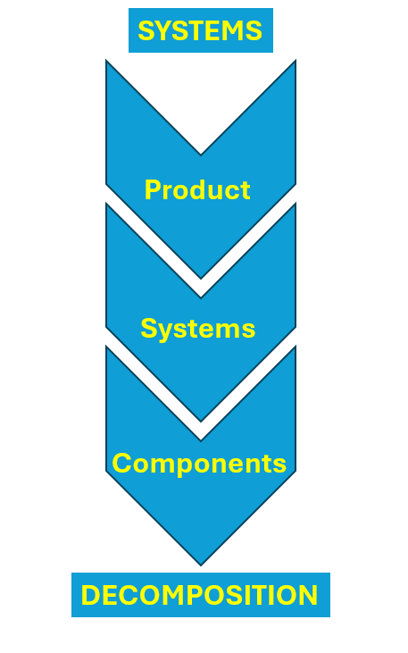
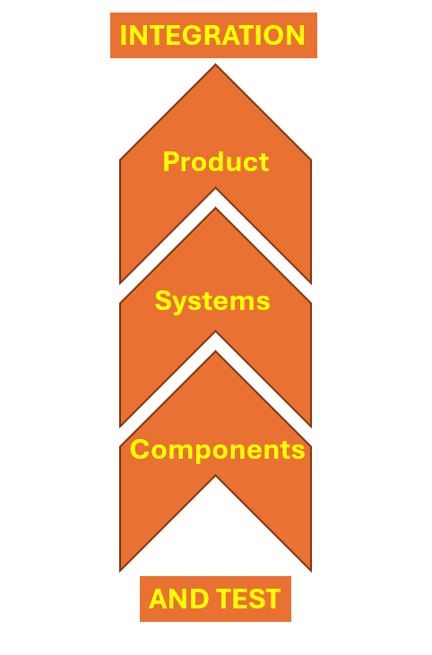
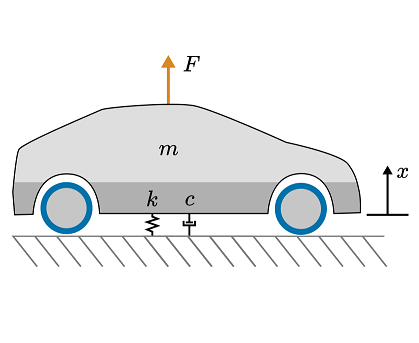

# Engineering Problem Solving

 or 

**Curriculum Module**

_Created with R2024b. Compatible with R2024b and later releases._

# Information

This curriculum module contains interactive [MATLAB® live scripts](https://www.mathworks.com/products/matlab/live-editor.html), [Simulink®](https://www.mathworks.com/products/simulink.html), and [Simscape™](https://www.mathworks.com/products/simscape.html) models that provide a means to solving multi\-disciplinary engineering problems through systems thinking. The focus will be on problem solving for engineered systems that are applicable from introductory engineering to capstone/senior design.

## Background

This initial release of the Engineering Problem Solving courseware features one interactive script that explores problem solving philosophy with emphasis on engineering and concepts that involve systems engineering.

The instructions inside the live scripts will guide you through the exercises and activities. Get started with each live script by running it one section at a time. To stop running the script or a section midway (for example, when an animation is in progress), use the  Stop button in the **RUN** section of the **Live Editor** tab in the MATLAB Toolstrip.

## Contact Us

Solutions are available upon instructor request. Contact the [MathWorks teaching resources team](mailto:onlineteaching@mathworks.com) if you would like to request solutions, provide feedback, or if you have a question.

## Prerequisites

This module assumes knowledge of some problem solving theory and calculus. There is minimal MATLAB knowledge required for these scripts and models, but you could use [MATLAB Onramp](https://matlabacademy.mathworks.com/details/matlab-onramp/gettingstarted), [Simulink Onramp](https://matlabacademy.mathworks.com/details/simulink-onramp/simulink), and [Simscape Onramp](https://matlabacademy.mathworks.com/details/simscape-onramp/simscape) as resources to acquire familiarity with MATLAB syntax, live scripts, and Simulink/Simscape models.

## Getting Started
### Accessing the Module
### **On MATLAB Online:**

Use the  link to download the module. You will be prompted to log in or create a MathWorks account. The project will be loaded, and you will see an app with several navigation options to get you started.

### **On Desktop:**

Download or clone this repository. Open MATLAB, navigate to the folder containing these scripts and double\-click on [EngineeringProblemSolving.prj](https://github.com/MathWorks-Teaching-Resources/Engineering-Problem-Solving/blob/main/EngineeringProblemSolving.prj). It will add the appropriate files to your MATLAB path and open an app that asks you where you would like to start. 

Ensure you have all the required products (listed below) installed. If you need to include a product, add it using the Add\-On Explorer. To install an add\-on, go to the **Home** tab and select   **Add-Ons** > **Get Add-Ons**. 

## Products

 *MATLAB®* is used throughout. Tools from  *Simulink® and Simscape™* are used frequently as well.  *If your module uses a product not on this list, you can find it* [*here*](https://www.mathworks.com/products.html)*.*

# Scripts

 *If you are viewing this in a version of MATLAB prior to R2023b, you can view the learning outcomes for each script* [*here*](https://www.mathworks.com/matlabcentral/fileexchange/180430-engineering-problem-solving)

## [**IntroToProblemSolving.mlx**](https://matlab.mathworks.com/open/github/v1?repo=MathWorks-Teaching-Resources/Engineering-Problem-Solving&project=EngineeringProblemSolving.prj&file=Scripts/IntroToProblemSolving.mlx) 
|  | **In this script, students will...**    | **Academic disciplines**     |
| :-: | :-- | :-- |
|     | $\bullet$ Explore the fundamentals of problem solving and systems engineering   $\bullet$ Enhance systems thinking skills by utilizing mathematical models   $\bullet$ Gain insights into methodologies for effectively approaching and solving problems   $\bullet$ Engage in project planning and understanding customer needs    |   $\bullet$ All Engineering Disciplines     |

## **DefiningRequirements.mlx (planned)** 
|  | **In this script, students will...**    | **Academic disciplines**     |
| :-: | :-- | :-- |
|     | $\bullet$ Gain experience in interpreting and analyzing problem statements   $\bullet$ Explore different types of requirements and identify what constitutes a useful requirement   $\bullet$ Develop your own set of requirements for a sample problem statement    |   $\bullet$ All Engineering Disciplines     |

## **SystemsDecomposition.mlx (planned)** 
|  | **In this script, students will...**    | **Academic disciplines**     |
| :-- | :-- | :-- |
|     | $\bullet$ Utilize the V\-model to deconstruct your problem   $\bullet$ Gain expertise in deconstructing problems into manageable work components   $\bullet$ Conduct verification activities to ensure compliance with design criteria    |   $\bullet$ All Engineering Disciplines     |

## **IntegrationAndTest.mlx (planned)** 
|  | **In this script, students will...**    | **Academic disciplines**    
| :-- | :-- | :-- |
|     | $\bullet$ Utilize the V\-model to construct your solution   $\bullet$ Gain expertise in integrating components and conducting system\-level testing   $\bullet$ Conduct validation activities to ensure compliance with customer needs    |   $\bullet$ All Engineering Disciplines     |

# License

The license for this module is available in the [LICENSE.md](https://github.com/MathWorks-Teaching-Resources/Engineering-Problem-Solving/blob/main/LICENSE.md).

# Related Courseware Modules
## [Introduction to Engineering with Arduino](https://www.mathworks.com/matlabcentral/fileexchange/156477-introduction-to-engineering-with-arduino)
|     | **Available on:**           [GitHub](https://github.com/MathWorks-Teaching-Resources/Intro-To-Engineering)     |
| :-- | :-- |

## [Battery Systems: introduction](https://www.mathworks.com/matlabcentral/fileexchange/172770-battery-systems-introduction?s_tid=srchtitle)
|     | **Available on:**           [GitHub](https://github.com/MathWorks-Teaching-Resources/Battery-Systems)      |
| :-: | :-- |

## [ Mass\-Spring\-Damper Systems](https://www.mathworks.com/matlabcentral/fileexchange/94585-mass-spring-damper-systems?s_tid=srchtitle)
|     | **Available on:**           [GitHub](https://github.com/MathWorks-Teaching-Resources/Mass-Spring-Damper-Systems)      |
| :-- | :-- |

Or feel free to explore our other [modular courseware content](https://www.mathworks.com/matlabcentral/fileexchange/?q=tag%3A%22courseware+module%22&sort=downloads_desc_30d).

# Educator Resources
-  [Educator Page](https://www.mathworks.com/academia/educators.html) 

# Contribute 

Looking for more? Find an issue? Have a suggestion? Please contact the [MathWorks teaching resources team](mailto:%20onlineteaching@mathworks.com). If you want to contribute directly to this project, you can find information about how to do so in the [CONTRIBUTING.md](https://github.com/MathWorks-Teaching-Resources/Engineering-Problem-Solving/blob/main/CONTRIBUTING.md) page on GitHub.

 *©* Copyright 2024 The MathWorks™, Inc

